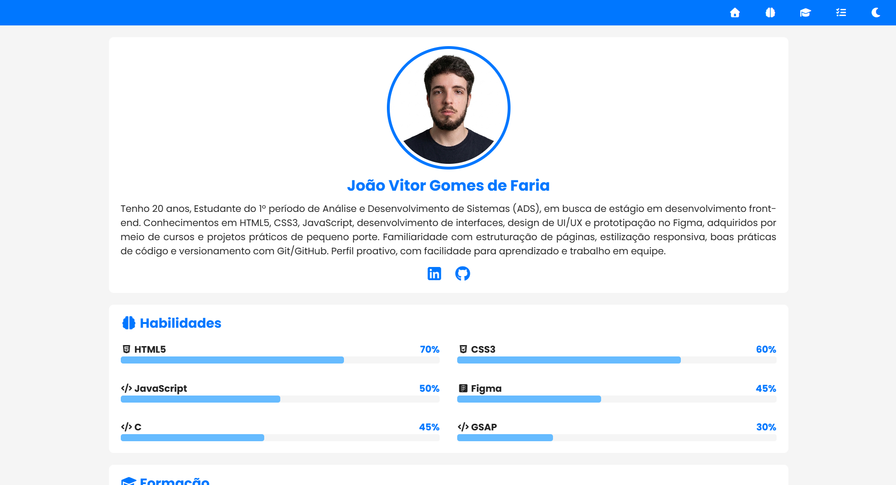

# 💼 Portfolio 1.0

> Meu primeiro portfólio como desenvolvedor front-end.

---

## 🚀 Sobre o projeto

Este projeto representa o início da minha jornada no desenvolvimento front-end.
A proposta foi criar um portfólio simples, organizado e funcional, aplicando os primeiros conceitos aprendidos.

---

## 🎯 Objetivo

* Praticar HTML, CSS e JavaScript
* Entender estrutura de um projeto real
* Criar minha primeira apresentação como desenvolvedor

---

## 🛠️ Tecnologias utilizadas

* HTML5
* CSS3
* JavaScript
* Gsap (mais básico)
  
---

## 🧠 O que aprendi

* Estruturação básica com HTML
* Estilização com CSS
* Noções de responsividade
* Organização de arquivos
* Boas práticas iniciais
* Introdução a Gsap
  
---

## 🖥️ Preview



---

## 📂 Estrutura do projeto

```id="k29dsa"
Portfolio1.0/
│
├── assets/
│   ├── img/
│   └── icons/
│
├── css/
│   └── style.css
│
├── js/
│   └── script.js
│
├── index.html
└── README.md
```

---

## 🔗 Acesse o projeto

👉 https://github.com/joaoviitordev/Portfolio1.0

---

## 👨‍💻 Autor

João Vitor

---

## ⭐ Observação

Este é meu primeiro projeto, então ainda está em evolução.
Novas versões virão com melhorias conforme avanço nos estudos.

---
